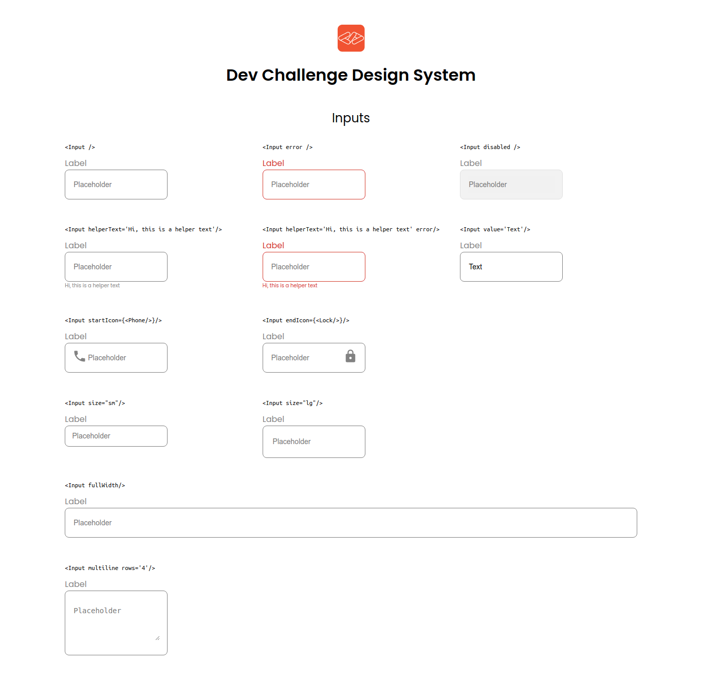

<!-- Please update value in the {}  -->

<h1 align="center">Input Component with Styled Components</h1>

<div align="center">
   Solution for a challenge from  <a href="http://devchallenges.io" target="_blank">Devchallenges.io</a>.
</div>

<div align="center">
  <h3>
    <a href="https://abulnes16.github.io/input-component/">
      Demo
    </a>
    <span> | </span>
    <a href="https://github.com/abulnes16/input-component">
      Solution
    </a>
    <span> | </span>
    <a href="https://devchallenges.io/challenges/TSqutYM4c5WtluM7QzGp">
      Challenge
    </a>
  </h3>
</div>

<!-- TABLE OF CONTENTS -->

## Table of Contents

- [Overview](#overview)
  - [Built With](#built-with)
- [Features](#features)
- [How to use](#how-to-use)
- [Contact](#contact)

<!-- OVERVIEW -->

## Overview



This project was built with React and Styled Components, the primary reason to use this library its because allow dynammic styling based on props and allow to write the style in CSS form. And most important of all I love the Sass syntax ❤️.

The icons used in this challenge are from React Icons, but you
can use the icon library you want.

### Built With

<!-- This section should list any major frameworks that you built your project using. Here are a few examples.-->

- [React](https://reactjs.org/)
- [Styled components](https://styled-components.com)
- [React Icons](https://react-icons.github.io/react-icons/)

## Features

<!-- List the features of your application or follow the template. Don't share the figma file here :) -->

This application/site was created as a submission to a [DevChallenges](https://devchallenges.io/challenges) challenge. The [challenge](https://devchallenges.io/challenges/TSqutYM4c5WtluM7QzGp) was to build an application to complete the given user stories.

## How To Use

<!-- Example:  -->

To clone and run this application, you'll need [Git](https://git-scm.com) and [Node.js](https://nodejs.org/en/download/) (which comes with [npm](http://npmjs.com)) installed on your computer. From your command line:

```bash
# Clone this repository
$ git clone https://github.com/your-user-name/your-project-name

# Install dependencies
$ npm install

# Run the app
$ npm start
```

## Contact

- Website [www.abulnes16.dev](https://abulnes16.dev)
- GitHub [@abulnes16](https://github.com/abulnes16)
- Twitter [@abulnes16](https://twitter.com/abulnes16)
